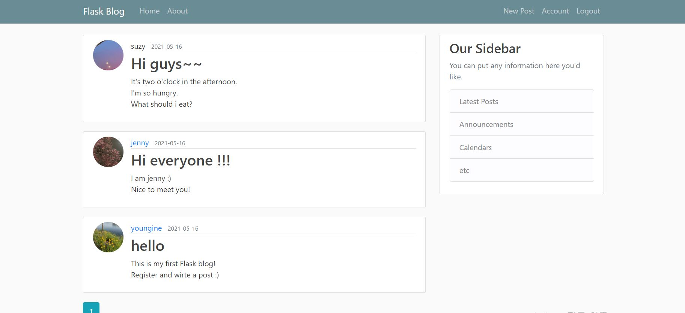
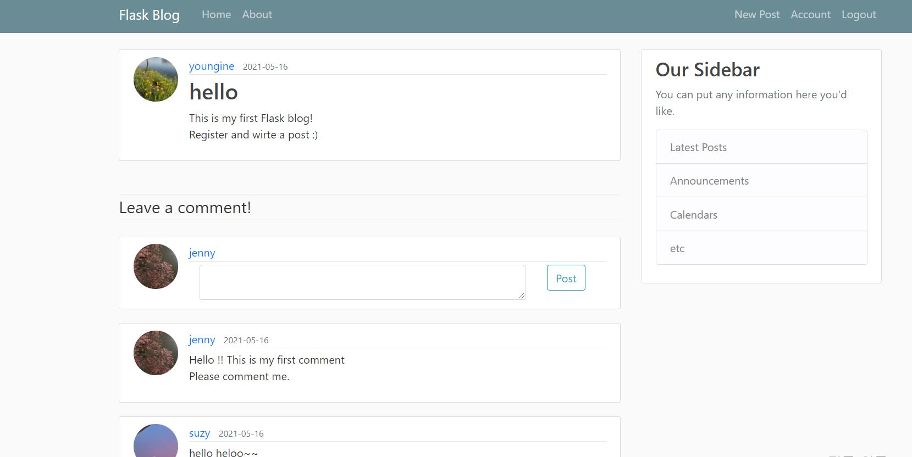
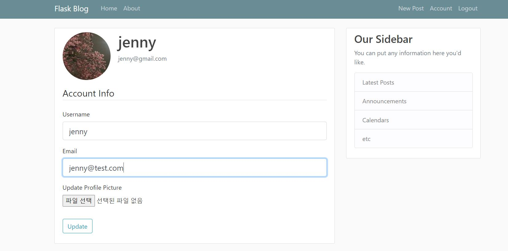

## SOME DEMO OUTPUT

## WHAT'S INCLUDED

### User Authentication
  - Authentication Extensions for Flask 
  - Password Security 
  - Hashing Passwords with Werkzeug 
  - Creating an Authentication Blueprint 
  - User Authentication with Flask-Login 
  - Preparing the User Model for Logins 
  - Protecting Routes 
  - Adding a Login Form 
  - Signing Users In 
  - Signing Users Out 
  - Testing Logins 
  - New User Registration 
  - Adding a User Registration Form 
  - Registering New Users 
  - Account Confirmation 
  - Generating Confirmation Tokens with itsdangerous 
  - Sending Confirmation Emails 
  - Account Management 

### User Profiles
  - Profile Information
  - User Profile Page
  - Profile Editor

### Blog Posts 
  - Blog Post Submission and Display
  - Blog Posts on Profile Pages
  - Paginating Long Blog Post Lists
  - Creating Fake Blog Post Data
  - Rendering Data on Pages
  - Adding a Pagination Widget

### Application Programming Interfaces
  - Creating an API Blueprint
  - Error Handling
  - User Authentication with Flask-HTTPAuth
  - Token-Based Authentication
  - Serializing Resources to and from JSON
